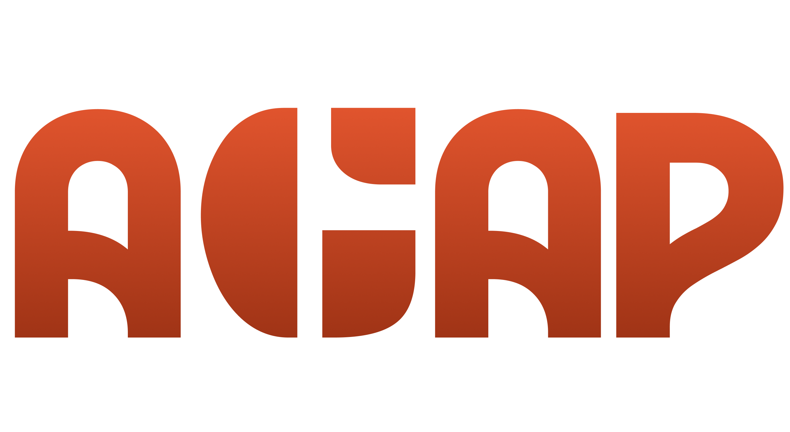

### *Alert. Guide. Assist. Protect*

## Overview

**AGAP** is a mobile emergency response app designed for **residents and Miagao MDRRMO (Municipal Disaster Risk Reduction and Management Office) personnel**. It streamlines how communities prepare for, report, and respond to emergencie - both for natural disasters or man-made accidents.

AGAP is built in consultation with **MDRRMO Miag-ao.** The system bridges a critical gap between residents in need and the responders who serve them. AGAP makes emergency coordination *faster*, *smarter*, and *calm*.

[View Full Documentation](docs/AGAP_Overview.pdf)

| Who It's For | What They Get |
|---|---|
| Residents | SOS alerts, medical info storage, family management |
| MDRRMO / Responders | Receive SOS, manage patient records, track incidents |

---

## Problem Statement

When emergencies strike, **every second counts;** however, current systems are often slow, fragmented, and paper-based.
- **No centralized medical information**: responders arrive without knowing a patient's allergies, conditions, or medications
- **Manualm, slow processes**: incident reports and patient forms are filled out by hand, causing delays and errors
- **Poor coordination**: residents have no reliable way to alert MDRRMO, and responders lack structured data to act quickly
- **No feedback loop**: resident who ask for help don't know if anyone is coming
- **Privacy gaps**: access to sensitive resident data is often unmonitored and unregulated

> There is a **visible gap within the current emergency response system.** One that leads to panic, wasted time, and preventable harm. AGAP aims to address it directly.

---

## Solution

AGAP transforms an existing **unsystematic process** into a **structured, digital emergency response platform**. It empowers residents to be proactive about their health information *before* an emergency happens, and gives responders the tools they need to act fast when it does.

**Core pillars of the solution:**
- **Preparedness** — residents fill out and maintain medical info in advance
- **Speed** — SOS alerts instantly deliver location and medical data to responders
- **Coordination** — a unified interface connects residents and MDRRMO seamlessly
- **Accountability** — data access is logged, encrypted, and privacy-respecting

> *"AGAP is not just for during a disaster, it prepares you before one even happens."*

---

## Key Features

### Residents' Interface

#### Onboarding
- **Sign-up page** where users log and create their acounts

#### Medical Information
- A dedicated **Medical Info Page** where residents store personal health data (conditions, medications, allergies, blood type, etc.)
- **Smart reminders:**
  - Notified within **1 week** of account creation if medical info hasn't been filled out yet
  - **Periodic update prompts** (e.g., every 3 months) to keep records accurate and current

#### SOS / Emergency Alert
- One-tap **SOS button** that sends the resident's **medical information + real-time location** to MDRRMO
- Works both online and offline via **mesh networking** — critical in disaster scenarios where connectivity is disrupted
- **Feedback mechanism** — after sending SOS, the resident receives a confirmation (e.g., *"Help is on the way"*) so they know their alert was received

#### Family & Emergency Contacts
- **Add and manage family members** within the app
- **Update family member information** as needed
- **Set a primary emergency contact** for priority notification

---

### MDRRMO / Responder Interface

#### Responder Profile & Access
- Dedicated **responder sign-up and profile page**
- Ability to **toggle between resident and responder interface** for personnel who are also community members

#### SOS Management
- **Receive SOS alerts** complete with resident's personal and medical information
- **Search for a resident's information** — all searches are **logged and monitored** for accountability (especially for cases where the patient did not send the SOS themselves)

---

### Patient Health Care (PHC) Form

- Responders can **create, edit, and update** Patient Health Care forms during or after an incident
- PHC forms can be created for **non-app users** as well (e.g., bystanders, unconscious individuals)
- **Auto-filled** with relevant data from: SOS alert, patient profile, and responder info — minimizing manual input
- **Export/generate as PDF** for easy endorsement to RHUs and medical facilities
- *Displayed resident info will eventually be filtered by concern type — generic view for now*

---

### Reports Tracker

- A **table-based incident tracker** for MDRRMO to monitor all reported emergencies
- Most fields are **automatically populated** from SOS data, patient info, and responder details
- Provides a clear, structured log of incidents for review and reporting purposes

---

## Data Privacy & Security

Security isn't an afterthought — it's built into the core of the system.

| Security Feature | Description |
|---|---|
| Account IDs | Every user (resident or responder) has a unique account identifier |
| Access Logging | All access to resident data is logged with personnel/account ID |
| Data Encryption | All sensitive data is encrypted at rest and in transit |

---

## How It Works 

```
1. SIGN UP
   L Resident creates an account → completes the onboarding guide

2. PREPARE
   Resident fills out Medical Info Page
   L App reminds them within 1 week if not yet filled
   L Periodic reminders to keep info updated

3. EMERGENCY OCCURS
   Resident taps the SOS button
   L App sends: location + medical info to MDRRMO
   L Works via mesh if no internet connection
   L Resident receives: "Help is on the way" confirmation

4. RESPONDER ACTS
   MDRRMO receives SOS alert with full resident profile
   L Responder dispatches and prepares based on medical data
   L On-site: PHC form is created/updated (auto-filled)

5. DOCUMENTATION & ENDORSEMENT
   Incident is logged in the Reports Tracker
```

---

## Impact

- **Faster emergency response** — responders arrive informed and prepared
- **Reduced panic and confusion** — residents know help is coming; responders know what to expect
- **Stronger community-MDRRMO coordination** — a shared, structured system replaces fragmented communication
- **Streamlined patient endorsement** — structured PHC forms make handoffs to healthcare facilities smoother
- **Covers all emergency types** — not limited to natural disasters; includes man-made accidents and incidents
- **Improved MDRRMO workflow** — less time on paperwork means more time responding

---

This project embodies the theme by emphasizing **preparedness over reaction**:

- Residents are **proactively maintaining** their medical records before emergencies happen
- MDRRMO gains tools to **respond faster and more effectively**
- The system **strengthens existing protocols and policies** rather than replacing them
- It reduces the chaos, time loss, and inefficiency that occur when communities are caught off guard

AGAP is about building **a culture of readiness** — so that when disaster strikes, the community is already one step ahead.

---

## Real-World Validation

This system was developed with **real stakeholders in mind**:

- **Consulted with MDRRMO Miag-ao** to understand actual workflows, pain points, and needs
- MDRRMO already uses **radio devices and has existing contacts with barangay officials** — this platform **complements and enhances** those systems rather than replacing them
- Residents are already **knowledgeable about nearby evacuation centers** — the app works within that existing awareness
- MDRRMO has existing protocols and technology for tracking weather, heat index, and seismic data — this platform fills the gap in **human emergency response coordination**

The result is a solution grounded in reality, not assumption.

---

## How to Download
### Android (APK)

1. Download the APK file here: **[Download Link — Coming Soon]**
2. On your Android device, go to **Settings → Security** and enable **"Install from Unknown Sources"**
3. Open the downloaded APK file and tap **Install**
4. Launch **AGAP** and create your account

---

## Team

| Name | Role |
|---|---|
| **Leona Blancaflor** | Backend Developer — SOS System |
| **Sam Lansoy** | Backend Developer — Responder Interface |
| **Myra Verde** | Backend Developer — Resident Interface |
| **Eleah Melchor** | Frontend Developer — Responder Interface |
| **Chrystie Sajorne** | Frontend Developer — Resident Interface |

*Built with love for communities that deserve better emergency systems.*