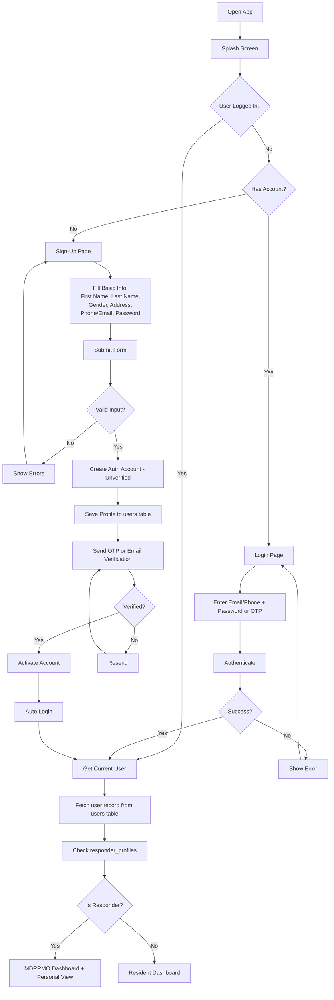

# Authentication Flow

<!-- the system will also use SMS-based OTP for identity verification. -->
<!-- However, for development and cost constraints, only email verification is used in this project. -->